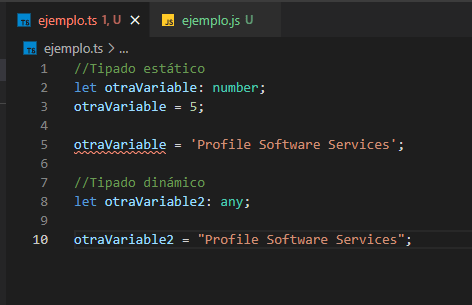
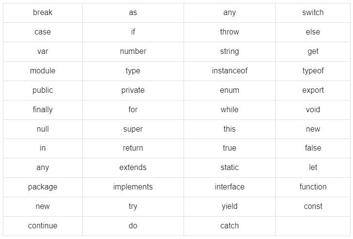
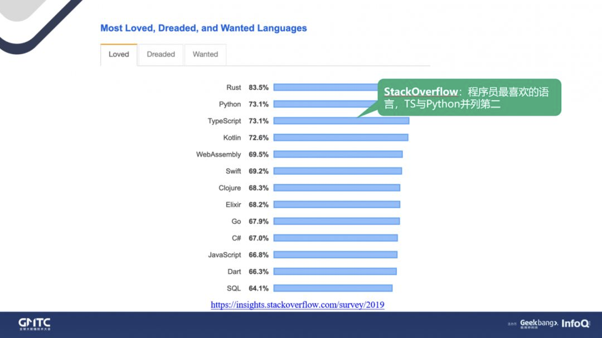
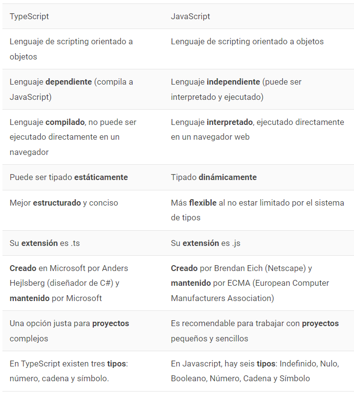

# 																			**TypeScript**					Emiliano Julian Salvachua 										Bautista Day Garcia

- ## Historia

TypeScript es un lenguaje de programación moderno que permite crear aplicaciones web robustas en JavaScript que no requiere de ningún tipo de plugin, puesto que lo que hace es generar código JavaScript que se ejecuta en cualquier navegador, plataforma o sistema operativo.

Surgió en el año 2012 con la finalidad de solventar las deficiencias del lenguaje de programación JavaScript, haciendo de él una herramienta más robusta. En otras palabras, el objetivo de Typescript es subsanar la falta de Language Aids y Refactors automáticos en JavaScript, la cual ocasiona la gran mayoría de los problemas que los usuarios del sistema suelen reportar.

Es un lenguaje de programación libre y de código abierto desarrollado por Microsoft. Es un superconjunto de JavaScript, que esencialmente añade tipado estático y objetos basados en clases.

El ejemplo de la imagen se trata de un fichero .ts, donde hacemos lo mismo que en el fichero JavaScript. La diferencia es que aquí te marca el error, ya que hemos declarado una variable tipo number y le hemos cambiado el valor por un string. Así, a la hora de compilar el código, también se marcará el error y no estará todo en orden hasta que lo arregles.

En definitiva, Typescript nació para ser un lenguaje alternativo con la ventaja de resultar mucho más amigable en cuanto a los asuntos de código se refiere.

- ## Tipo de compilación

TypeScript es un "transpilador", es decir, un compilador que se encarga de traducir las instrucciones de un lenguaje a otro, que intenta realizar las funciones de un compilador más las funciones de un traductor de instrucciones. Se puede considerar como si fuese Javascript con esteroides, que agrega funcionalidades al lenguaje base, esto es conocido como un superset. 

Este lenguaje genera código Javascript, es decir, escribirás código Typescript pero el producto final será compilado finalmente a javascript y la versión del javascript en la cual será compilado junto con otras configuraciones estará en el archivo tsconfig.

- ## Palabras claves del lenguaje

La siguiente tabla muestra algunas palabras clave del lenguaje TypeScript:

- ## Sensibilidad respecto a las mayúsculas y minúsculas

TypeScript es un lenguaje sensible a mayúsculas y minúsculas. Esto implica que las palabras clave del lenguaje, las variables, los nombres de operación y los otros identificadores deben estar escritos a máquina con letras mayúsculas idénticas. Por ejemplo, los identificadores Time y TIME pueden transmitir significados totalmente diferentes en TypeScript.

- ## Salario medio de un programador de TypeScript

El salario promedio nacional de un programador de TypeScript es de $ 80,760 en los Estados Unidos de América y de unos 57.433€ en España.

- ## Comunidad del lenguaje

Cada vez mas proyectos front-end conocidos de código abierto eligen TypeScript como su nuevo lenguaje de desarrollo, y el apoyo de la comunidad a Typescrypt cada vez es mayor.

Se encuentra en el puesto 3 de los 13 lenguajes mas valorados por los usuarios, estando empatado con Python y solo superado por Rust.

 

- ## Influencia de otro lenguaje

TypeScript es un superconjunto de JavaScript que está diseñado para usarse en paralelo con JavaScript para ofrecer verificación de tipo para grandes bases de código JavaScript. El uso de TypeScript tiene el potencial de extender la vida útil de JavaScript al ofrecer a los desarrolladores la verificación de tipos que es útil en grandes bases de código con muchos errores. Es un lenguaje de programación que cierra la brecha entre JavaScript y otros lenguajes como Java, C # y Python. Fue desarrollado por Microsoft con el objetivo de facilitar el uso de tipos para admitir proyectos a gran escala.

Este lenguaje tiene varios beneficios que lo convierten en una mejor opción que JavaScript. Proporciona escritura estática para que no tenga que declarar variables antes de usarlas, lo que le muestra un error si está usando una variable incorrectamente. TypeScript también incluye algunas características que no están incluidas en JavaScript, como clases, interfaces, verificación de tipo opcional en variables o simplemente en parámetros de función o valores de retorno, y módulos que pueden ayudar a organizar su código para proyectos de cualquier tamaño.

- ## Multiplataforma

Multiplataforma: Se puede ejecutar tanto en Windows, como Linux o MacOs

